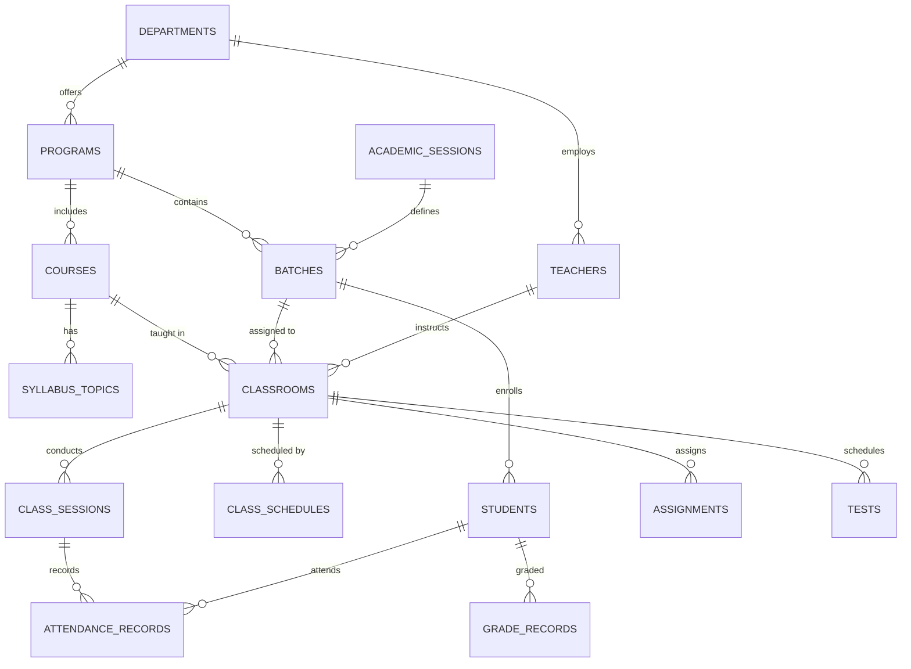

# Scholaris Admin Backend Architecture & API Specification

Comprehensive blueprint for the **Express.js + PostgreSQL** backend powering the **Scholaris Admin Panel**.

---

## 1. System Overview & Tech Stack

- **Server Framework**: Express.js (Node.js with TypeScript)
- **Database**: PostgreSQL 14+ with `pg` connection pool
- **Data Validation & Parsing**: Express JSON parser + strict parameter validation
- **Architecture Pattern**: Layered MVC (Routes $\rightarrow$ Controllers $\rightarrow$ SQL Queries / Models $\rightarrow$ PostgreSQL)
- **Security & Utilities**: CORS, Environment-based configuration, parameterized SQL injection prevention.

---

## 2. PostgreSQL Relational Database Schema

---

## 3. Step-by-Step Backend Implementation Roadmap

### **Phase 1: Database Setup, Connection & Seeding**
- [x] Configure PostgreSQL connection pool (`src/config/db.ts`)
- [x] Define relational DDL schema (`src/db/schema.sql`)
- [x] Implement database initialisation and automated seeding script (`src/db/seed.ts`)

### **Phase 2: Academic Core Module (CRUD)**
- **Departments API**: `/api/admin/academic/departments`
- **Programs API**: `/api/admin/academic/programs`
- **Academic Sessions API**: `/api/admin/academic/sessions`
- **Batches & Curriculum API**: `/api/admin/academic/batches`
- **Courses API**: `/api/admin/academic/courses`
- **Course Syllabus / Outline API**: `/api/admin/academic/syllabus`

### **Phase 3: User Management Module (CRUD)**
- **Teachers API**: `/api/admin/users/teachers`
- **Students API**: `/api/admin/users/students`
- **Admin Accounts API**: `/api/admin/users/admins`

### **Phase 4: Classroom Management & Scheduling**
- **Classrooms API**: `/api/admin/classrooms` (with rich joins: Teacher, Course, Batch, Session)
- **Class Schedules API**: `/api/admin/schedules`

### **Phase 5: Academic Activities & Auditing**
- **Class Sessions API**: `/api/admin/activities/sessions`
- **Attendance Registry API**: `/api/admin/activities/attendance`
- **Assignments & Submissions API**: `/api/admin/activities/assignments`
- **Class Tests & Quizzes API**: `/api/admin/activities/tests`
- **Results & Grades API**: `/api/admin/activities/results`

### **Phase 6: Institutional Services & Analytics**
- **Announcements API**: `/api/admin/announcements`
- **Institution Settings API**: `/api/admin/settings`
- **Admin Dashboard KPI & Reports API**: `/api/admin/reports`

---

## 4. Admin API Endpoint Reference

### **A. Academic Management**
| Method | Endpoint | Description |
|---|---|---|
| `GET` | `/api/admin/departments` | List all departments |
| `POST` | `/api/admin/departments` | Create new department |
| `PUT` | `/api/admin/departments/:id` | Update department |
| `DELETE` | `/api/admin/departments/:id` | Delete department |
| `GET` | `/api/admin/programs` | List all academic programs |
| `POST` | `/api/admin/programs` | Create new program |
| `PUT` | `/api/admin/programs/:id` | Update program |
| `DELETE` | `/api/admin/programs/:id` | Delete program |
| `GET` | `/api/admin/sessions` | List academic terms/sessions |
| `POST` | `/api/admin/sessions` | Create academic session |
| `PUT` | `/api/admin/sessions/:id` | Update session |
| `DELETE` | `/api/admin/sessions/:id` | Delete session |
| `GET` | `/api/admin/batches` | List batches (with enrolled student counts) |
| `POST` | `/api/admin/batches` | Create batch with curriculum courses |
| `PUT` | `/api/admin/batches/:id` | Update batch details & semester count |
| `DELETE` | `/api/admin/batches/:id` | Delete batch |
| `GET` | `/api/admin/courses` | List courses |
| `POST` | `/api/admin/courses` | Create course |
| `PUT` | `/api/admin/courses/:id` | Update course |
| `DELETE` | `/api/admin/courses/:id` | Delete course |
| `GET` | `/api/admin/syllabus` | List all syllabus topics (filterable by course) |
| `POST` | `/api/admin/syllabus` | Create syllabus outline topic with key concepts |
| `PUT` | `/api/admin/syllabus/:id` | Update topic title, week, or status |
| `DELETE` | `/api/admin/syllabus/:id` | Delete syllabus topic |

### **B. User Management**
| Method | Endpoint | Description |
|---|---|---|
| `GET` | `/api/admin/teachers` | List all teachers with department & assigned courses |
| `POST` | `/api/admin/teachers` | Create teacher account |
| `PUT` | `/api/admin/teachers/:id` | Update teacher details |
| `DELETE` | `/api/admin/teachers/:id` | Remove teacher |
| `GET` | `/api/admin/students` | List students (filterable by batch & program) |
| `POST` | `/api/admin/students` | Register student into batch |
| `PUT` | `/api/admin/students/:id` | Update student profile |
| `DELETE` | `/api/admin/students/:id` | Remove student |
| `GET` | `/api/admin/admins` | List institutional staff & admin users |
| `POST` | `/api/admin/admins` | Add admin user |
| `PUT` | `/api/admin/admins/:id` | Update admin user |
| `DELETE` | `/api/admin/admins/:id` | Delete admin user |

### **C. Classroom & Schedule Management**
| Method | Endpoint | Description |
|---|---|---|
| `GET` | `/api/admin/classrooms` | Get all classrooms with joins (Course, Batch, Teacher) |
| `GET` | `/api/admin/classrooms/:id` | Get classroom details + schedules + syllabus + sessions |
| `POST` | `/api/admin/classrooms` | Create classroom linking Course + Batch + Teacher + Room + Schedule |
| `PUT` | `/api/admin/classrooms/:id` | Update classroom parameters |
| `DELETE` | `/api/admin/classrooms/:id` | Delete classroom |
| `GET` | `/api/admin/schedules` | List weekly routine time-slots |
| `POST` | `/api/admin/schedules` | Create routine schedule |
| `DELETE` | `/api/admin/schedules/:id` | Delete routine schedule |

### **D. Academic Activities & Reports**
| Method | Endpoint | Description |
|---|---|---|
| `GET` | `/api/admin/activities/sessions` | Global class lecture logs audit |
| `GET` | `/api/admin/activities/attendance` | Attendance logs across all classrooms |
| `GET` | `/api/admin/activities/assignments` | Institutional coursework & submissions overview |
| `GET` | `/api/admin/activities/tests` | Class tests, quizzes & average marks |
| `GET` | `/api/admin/activities/results` | Student transcripts and grade distribution |
| `GET` | `/api/admin/reports/attendance` | Aggregated attendance report by batch & course |
| `GET` | `/api/admin/reports/dashboard-stats`| Summary KPIs (Total Students, Teachers, Ongoing Classes, Avg Attendance) |

### **E. Announcements & Settings**
| Method | Endpoint | Description |
|---|---|---|
| `GET` | `/api/admin/announcements` | List all institutional announcements |
| `POST` | `/api/admin/announcements` | Publish targeted announcement (Global, Program, Batch, Course) |
| `PUT` | `/api/admin/announcements/:id`| Edit announcement |
| `DELETE` | `/api/admin/announcements/:id`| Remove announcement |
| `GET` | `/api/admin/settings` | Get school name & logo branding |
| `PUT` | `/api/admin/settings` | Update school branding & settings |
